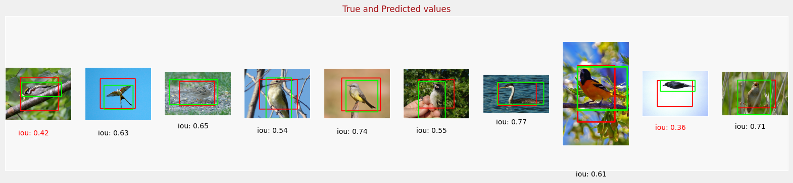

# Predicting-Bounding-Boxes

The prediction results are shown in the GIF below. You can also take a look at the [website](https://huggingface.co/spaces/randyjhc/Predicting-Bounding-Boxes).

This project is modified from the week 1 programming assignment for the Advanced Computer Vision course.

In this assignment, we have built a model to predict bounding boxes around images.

We performed transfer learning on one of the pre-trained models available in Keras and used the [Caltech Birds - 2010 dataset](https://www.vision.caltech.edu/datasets/).

Then the model is deployed to Hugging Face using gradio.

# Model Graph

We build a feature extractor using MobileNetV2.

Next, we define the dense layers following the extractor.

Lastly, we define a dense layer that outputs the bounding box predictions.

# Losses Trend

The losses are measured by mean squared error (MSE).

# Bounding Box Outputs

The output bounding boxes (red) are presented along with the ground truth bounding boxes (green).

We evaluate how well the model predicts the bounding box by calculating the Intersection-over-union (IoU) score for each image.

